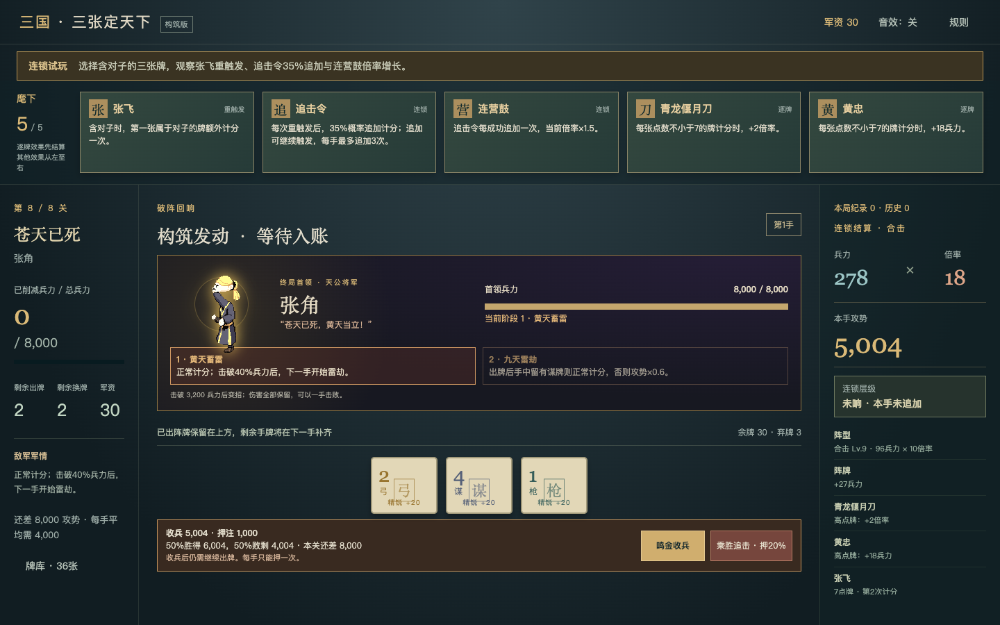

# v0.6 纯随机追击与连锁反馈

v0.6保留原本的追击规则：持有追击令时，每次真实重触发后有35%概率追加计分，成功后可以继续追击，单手最多追加3次。没有军势、聚势、概率累积或保底按钮。

首页“连锁试玩 · 直达张角”提供固定成型构筑。选择含对子的三张牌，可以观察张飞重触发、追击令判定、连营鼓倍率增长和张角受击；试玩不写入正式征程。

结果只根据真实追加次数显示四档反馈：0次“未响”、1次“追击”、2次“连营”、3次“破军”。预览不推进随机流，减少动态效果时关闭非必要动画。

