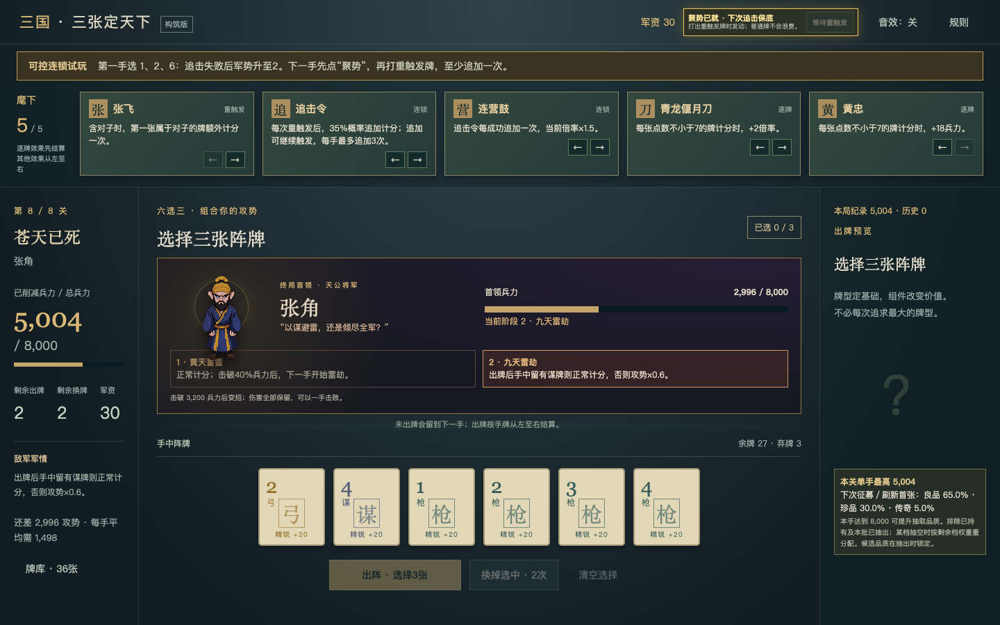
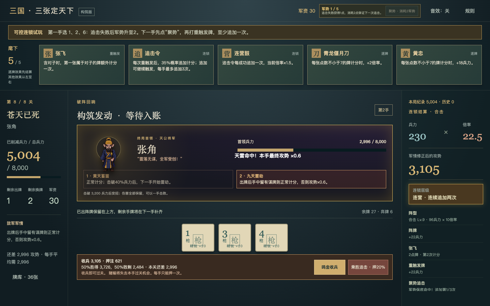

# v0.6 军势与保底追击验证

本轮验证一个很小的“可控柏青哥”循环：随机追击落空时获得1点军势，玩家消耗2点军势，让下一次符合条件的追击必定成功。随机仍负责制造悬念，玩家决定何时兑现积累。

## 可复现试玩

1. 在首页点击“可控连锁试玩 · 直达张角”。试玩使用独立固定局面，不写入正式征程。
2. 第一手选择第1、2、6张并出牌。固定的追击落空后，军势从1升至2。
3. 跳过演出并鸣金收兵，进入下一手，点击顶部的“聚势”。
4. 从六张牌中选出一对，再补一张牌并出牌。第一次追击必定成功，后续追击仍按35%判定。

## 验证边界

- 预览不会增加军势、消耗聚势或推进随机流。
- 没有重触发的手牌不会浪费聚势。
- 保底成功不消耗原本的随机判定；后续追加继续使用独立敌军随机流。
- 军势上限5，状态跨手牌、关卡和重启保存，旧版存档仍保留在原键位。
- 结算只按真实追加次数显示“蓄势／追击／连营／破军”，减少动态效果时关闭循环和冲击动画。
- 张角第二阶段的天雷规则仍独立生效：若出牌后手中未保留谋牌，最终得分乘0.6；聚势不会免除该惩罚。

规则测试覆盖失败积势、上限、原子扣费、无效操作、预览纯度、随机流和重启恢复。浏览器测试覆盖从固定落空到主动聚势再到保底命中的完整操作。桌面烟雾测试覆盖正式征程、存档恢复、张角、极限挑战和可控追击状态；macOS与Windows包按锁定依赖重新构建。
