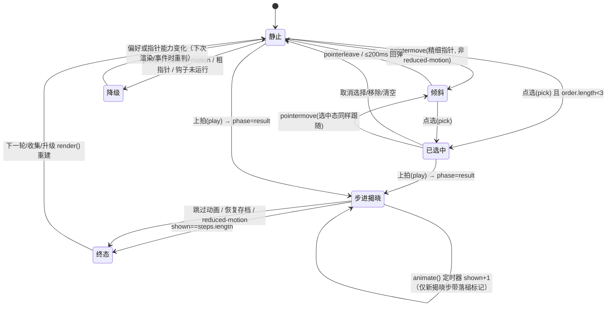

## Context

### 现状

`apps/playtest` 是纯 DOM + CSS 的展示层：`apps/playtest/public/trigger.css` 为 6028 字节的单行压缩样式，`apps/playtest/src/main.ts` 为 11002 字节、36 行的单行压缩脚本，界面全部由模板字符串拼装，每次状态变化整块 `app.innerHTML` 重建。卡牌为 `<button class="card">`，只有平面渐变（`linear-gradient(150deg,…)`）、单层 `box-shadow` 与 `translateY(-4px)` 悬浮，没有透视、厚度、材质或统一光源。规则内核 `packages/core/src/trigger.ts`（`TriggerState.phase ∈ {battle,result,reward,upgrade,victory,defeat}`）与内容 `packages/content/src/trigger.ts` 与展示层完全解耦，展示层只读 `triggerView()` 与 `previewTrigger()`。

本阶段为 **AI-Spec 生成节点**，不修改生产代码；产出规格与实施任务，供 AI-编码节点执行。

### 实测证据（本机 Chromium 135.0.7049.78 + 仓库基线 `f5ae6b8`）

| 证据 | 结论 | 验证方式 |
|---|---|---|
| E1 | `<button>` 上 `transform-style: preserve-3d` 生效：带 `translateZ(-40px)` 的投影板相对静止态被缩小（宽 102.76 → 98.56）并产生视差位移（left 15.55 → 5.94）。**卡牌无需新增包裹层**即可做卡面/投影分层 | 临时探针页面测量 `getBoundingClientRect()` |
| E2 | 祖先 `overflow: auto`（`.modal` 现状）**不阻断卡牌自身的 3D 分层**：滚动容器内与无滚动容器内的投影板矩形完全一致（98.56/14.78/left 15.94）。仅存在容器边界裁切风险 | 同上，对照 `overflow:auto` / 无 `overflow` 两组 |
| E3 | 页面 CSP `style-src 'self'` **拦截 HTML 内联 `style` 属性**并产生控制台错误；**放行** JS 经 CSSOM `element.style.setProperty()` 写入（`--rx: 8deg` 读取成功） | 在 `npm run dev` 的真实页面注入元素并读取计算样式 |
| E4 | 静止态卡牌计算 `transform` 为 `matrix(1,0,0,1,0,0)`（即无变换），悬停位移来自 `.card:hover` 的 `translateY(-4px)` | 真实页面 `getComputedStyle` |
| E5 | 3D 变换计入滚动溢出：基线 1280×800 下 `scrollWidth == innerWidth == 1280`，文档高度 933 > 800（本就纵向滚动）。横向余量为 `4vw`（1280 下约 51px），有界倾斜的投影外扩量级仅 1–2px | 真实页面测量 |
| E6 | 基线验证：`npm ci` 通过；`npm run build`（`tsc --noEmit` + `vite build`）通过；`npm test` 11/11 通过（Node 22.21，低于 README 要求的 24）；`npm run test:browser` 在仓库默认配置下因 `channel:'chrome'` 且本机无 Chrome 而失败，改用临时配置指向系统 Chromium（`/opt/chromium.org/chromium/chromium-browser`）后 **3/3 通过** | 本机执行 |
| E7 | 基线控制台存在 1 条既有 404（非本次引入），CSP 违规会以控制台 error 形式出现，而非 `pageerror` | 真实页面监听 `console` / `pageerror` |
| E8 | 远端并行分支 `origin/optimize/product-ui-kkrx`（`optimize-playtest-ui-consistency`）只新增 OpenSpec 文档，尚未改代码；其规格已规定 `trigger.css` 的 `--auction-*` 令牌层、`:root` 外零颜色字面量、`.card small` ≥12px 与三变体对比度 ≥4.5:1、弹层 `role="dialog"` 与焦点管理、`aria-pressed`、700px 无横向溢出 | `git diff --stat main origin/optimize/product-ui-kkrx`、读取其 proposal/design/spec |

## Goals / Non-Goals

Goals：在不改规则内核、数值、内容、存档协议与信息架构的前提下，为 `apps/playtest` 建立统一材质/光源/色阶，并给卡牌加入 CSS 3D 纵深、指针跟随倾斜、选中 Z 轴抬升与结算落槌过渡；全部结论可被自动化断言或截图证据验证。

Non-Goals：不改 `packages/core`、`packages/content`；不改存档协议 `trigger-1` 与存档键；不新增页面/路由/文案；不引入 WebGL、three.js 或任何运行时依赖与外部素材；不新增 Playwright 像素基线；不改 `index.html` CSP、`apps/desktop` 与打包链；不改动任何既有 capability 的 Requirement 文本。

## 模块边界与改动面

| 文件 / 区域 | 本次改动 | 明确不改 |
|---|---|---|
| `apps/playtest/public/trigger.css` | `:root` 展示令牌；卡牌材质层与三变体非色相差异；卡牌 3D 分层与状态变换；落槌 `@keyframes`；页面色阶/字重节奏；reduced-motion 降级 | 选择器结构与类名；`.card small` 字号；卡面渐变端点色与文本色；`.hand` 的 `display: grid` 与列数；`.modal` 的 `overflow: auto` |
| `apps/playtest/src/main.ts` | `#app` 上新增 `pointermove`/`pointerleave` 委托与 CSSOM 变量写入；结算渲染为当前步卡牌加一次性动画标记 | 渲染架构与模板结构；动作路由 `data-action` 分支；文案与 `aria-label`；存档读写；`animate()` 的步进节奏（`Math.max(140,440-shown*30)`） |
| `apps/playtest/index.html` | 无 | CSP、资源引用 |
| `packages/core`、`packages/content` | 无 | 全部 |
| `apps/desktop`、`vite.config.ts`、`package.json` | 无 | 全部 |
| `tests/browser/trigger.spec.ts` | 新增断言（倾斜/选中/结算/降级/视口/契约） | 既有 3 个用例的语义与断言 |
| `docs/evidence/` | 新增 `UI_DEPTH_V09.md` 与 1280/1440 前后对比截图 | 不改规则文档 |

### 契约清单

| 契约 | 内容 | 验证方式 |
|---|---|---|
| C1 令牌契约 | 本次新增的颜色/渐变/阴影/纹理一律在 `:root` 以 `--auction-*` 声明；`:root` 外不新增颜色字面量；纹理为 inline `data:` URI 且不使用 `rgb()/rgba()/hsl()/hsla()` 文本形式 | 静态断言 + 文本扫描 |
| C2 DOM 钩子契约 | 卡牌仍为 `<button class="card">`，保留 `data-action` / `data-id` / `data-kind` / `data-bonus`；结算卡牌保留 `tabindex="-1"`；倾斜与动画只通过新增属性/类与 CSS 变量驱动 | 浏览器断言 |
| C3 事件契约 | 倾斜只由 `#app` 上的 `pointermove`/`pointerleave` 委托驱动；只在 `(hover:hover) and (pointer:fine)` 且非 reduced-motion 时生效；不新增点击热区、不改变 `data-action` 语义 | 浏览器断言 + 人工回归 |
| C4 动画归属契约 | 落槌过渡只作用于 `result.steps[shown-1].id` 对应卡牌；标记为一次性状态，渲染后消费清除；跳过/恢复/reduced-motion 路径不带标记 | 浏览器断言 |
| C5 回归红线 | `packages/*` 未改；`trigger-1` 与 `midnight-hammer:trigger-1` 未改；按钮文案、`aria-label`、`.scoreboard strong` 含 `=`、规则弹层含 `18 × 2 = 36`、`.ending` 含 `收藏，已成连锁。`、`:focus-visible`、`aria-live`、`role="alert"` 全部保持 | 既有 11 项单元 + 3 项浏览器用例 |
| C6 资源与安全契约 | 无新增依赖、无外部网络资源、无 HTML 内联 `style`；CSP `style-src 'self'` / `img-src 'self' data:` 不变且够用 | 构建产物检查 + 真实页面控制台 |
| C7 可访问性契约 | Tab 可达、`:focus-visible` 可见、`aria-label` 不变、变换后可见区域与命中区域一致 | 浏览器断言 |

## 接口与缓存

接口：本变更**不新增、不修改任何对外或内部接口**——无 HTTP/RPC、无 MQ 消费者、无定时任务、无回调与 Webhook，也无页面路由新增；AI 评测/试玩协议 `schemaVersion 2` 与 `tools/ai-play-*.ts` 入口不变。展示层与规则内核之间仍是既有的同步函数调用（`triggerView` / `previewTrigger` / `actTrigger`），调用签名与语义不变。

缓存：不新增持久缓存、Service Worker 或构建期产物；唯一的运行期缓存是悬停倾斜用的卡牌矩形缓存（见 D-16），其生命周期为单次指针停留，并在 `pointerenter` / 滚动 / 缩放 / 渲染重建后失效，不参与任何规则计算。

## 数据模型与持久化

本次**无 DDL、无 schema 变更、无迁移**。唯一持久化仍是 `localStorage[midnight-hammer:trigger-1]`（协议 `trigger-1`），字段与校验（`isTriggerState`）不变。

展示层瞬时状态（**不入存档、不参与规则判断**，仅存在于 DOM/CSS 变量）：

| 状态 | 载体 | 生命周期 | 归零时机 |
|---|---|---|---|
| 指针倾斜 `--rx` / `--ry` | 卡牌元素自身自定义属性（CSSOM 写入） | 指针停留期间 | `pointerleave`、卡片被移除、reduced-motion |
| 高光位置 `--mx` / `--my` | 同上 | 同上 | 同上 |
| 抬升 `--tz` | 由 `.selected` 类经 CSS 规则给出 | 选中期间 | 取消选择/移除/移动/清空 |
| 落槌动画标记 | 结算当前步卡牌上的属性/类 | 单次步进渲染 | 渲染后消费清除、跳过、终态 |

一致性约束：展示层是 `state` 的**只读投影**。`shown` 单调递增，展示层不得回写 `state`，也不得调用任何 core 写操作（`actTrigger` 仅由既有动作路由触发）。

## 展示层状态机



转换明细：

| 转换 | 触发 | 进入条件 | 退出条件 | 失败/异常处理 |
|---|---|---|---|---|
| 静止 → 倾斜 | `pointermove` 命中可交互卡牌 | `hover:hover && pointer:fine` 且非 reduced-motion | `pointerleave` 或 ≤200ms 回弹 | 取不到卡牌矩形时跳过本帧，不写入变量 |
| 倾斜 → 已选中 | 点选 | `order.length < 3` 且卡牌在手牌中 | 取消/移除/清空/上拍 | 既有 `pick` 路由不变，非法点选不改变 `order` |
| 已选中 → 步进揭晓 | 上拍 | `preview` 非空（既有按钮 disabled 规则） | `shown == steps.length` | core 抛错时走既有 `error` 提示，`shown` 归零 |
| 步进揭晓 → 终态 | 定时器/跳过/恢复 | — | 渲染出 `data-action="next"` | 跳过调用既有 `stop()` + `shown=length`，幂等 |
| 任意 → 降级 | 媒体查询匹配 | reduced-motion 或非精细指针 | 偏好变化后重判 | 只去掉动效，信息与控制全保留 |

状态机推演补全点（原需求未显式提及，本次必须闭环）：

1. **渲染重建自愈**：每次状态变化整块重建 DOM，任何动画/倾斜状态必须随节点消失，不允许有跨渲染的残留（否则出现"抖动/重放"）。
2. **终态幂等**：跳过、恢复存档、reduced-motion 三条路径进入同一终态；进入终态不携带动画标记，重复触发无副作用。
3. **指针能力与偏好可变**：系统"减少动态效果"或指针类型在运行中变化时，在下一次 `pointermove`/渲染时重新判定并清除残留变量。
4. **结算中重渲染**：结算期间打开/关闭规则或收藏弹层会触发 `render()`，此时不得重放落槌动画。

## 核心流程

### 流程 1 · 悬停倾斜（同步，单帧）

1. `pointermove` 冒泡到 `#app`，命中 `closest('.hand .card, .rewards .card, .compact .card')`；否则不处理。
2. 能力判定：`matchMedia('(hover: hover) and (pointer: fine)')` 且 `!matchMedia('(prefers-reduced-motion: reduce)')`；否则跳过并清除已有变量。
3. 取卡牌矩形（同一卡牌同一帧最多一次，`pointerenter`/滚动/缩放后失效缓存）。
4. 计算归一化指针位置 → `--ry ∈ [-8°, 8°]`、`--rx ∈ [-8°, 8°]`（方向与指针位置一致）、`--mx/--my` 高光位置。
5. `requestAnimationFrame` 合帧后以 CSSOM `setProperty` 写入（每帧每卡最多一次写入）。
6. `pointerleave`：清除变量，卡牌在 ≤200ms 内回到静止态（`transition: transform .15s` 既有时长即可满足）。
7. 边界：卡牌被移除（`render()`）时，模块级"当前倾斜卡牌"引用必须清空，避免向脱离 DOM 的节点写变量。

### 流程 2 · 选中与抬升

1. 点选 → 既有 `pick` 路由更新 `order` → `render()`。
2. 选中卡牌带 `.selected`，CSS 给出 `--tz` 正位移与更强投影；"第 N 位"标注与槽位 `01/02/03` 同索引对应关系不变。
3. 取消/移除/移动/清空 → `render()` → 卡牌回到静止变换与静止投影（无残留 `--tz`）。
4. 边界：三张全选时 `pick` 不再入队（既有逻辑），选中卡仍可悬停倾斜，倾斜与抬升叠加但角度受限，不得遮挡本卡文本。

### 流程 3 · 结算落槌（异步，逐步）

1. 上拍 → core 产出 `result`（含 `steps[]`，每步有 `id` 字段指向卡牌）→ `phase='result'`，`shown=0`。
2. 非 reduced-motion 时 `animate()` 以既有节奏递增 `shown` 并 `render()`；本次递增的渲染为"新揭晓步"，其卡牌获得一次性落槌标记。
3. 落槌动画：沿 Z 轴压落 + 投影收紧再扩散；牌面正向、文本全程可读（不翻面、无牌背）。
4. `shown == steps.length` 或点击"跳过动画" → 终态：无卡牌带标记，`.scoreboard strong` 显示 `= total`，出现既有 `data-action="next"`。
5. 边界：同一步骤可能重复指向同一卡牌（重触发），按步重复落槌即为期望节拍；`render()` 重建后动画自然只播放一次。

### 流程 4 · 降级

1. reduced-motion：不挂倾斜、不播放落槌；结算直接呈现终态（保留既有 `shown = steps.length` 逻辑）。
2. 非精细指针 / 无 hover：无倾斜；选择、排序、上拍、跳过、收集、升级全部可用。
3. 指针钩子未运行（异常/旧环境）：静态分层呈现与全部交互仍可用。

## 并发、幂等与异步

| 场景 | 期望 | 机制 | 验证 |
|---|---|---|---|
| 快速连点同一张卡 | `order` 与渲染结果确定，无残留 | 既有 `pick` 路由 + 整块重建 | 既有浏览器用例 + 新增连点断言 |
| 结算期间连点"跳过动画" | 立即终态且只入账一次 | `stop()` 清定时器 + `shown=length`（幂等） | 新增断言 |
| 重复结算 / 连续两轮 | 不残留动画标记与变量 | 动画标记一次性消费；DOM 重建自愈 | 新增断言（终态标记数 = 0） |
| 结算中打开/关闭弹层 | 不重放落槌动画 | 非步进渲染不产生标记 | 新增断言 |
| 同一帧多次 `pointermove` | 每帧每卡最多一次写入 | `requestAnimationFrame` 合帧 | 人工性能回归（DevTools） |
| 偏好/指针能力运行中变化 | 下次事件/渲染后降级 | 事件与渲染时重判媒体查询 | 新增 reduced-motion 断言 |

## 事务与一致性

无跨进程或跨存储事务：唯一写入仍是 `localStorage` 存档（既有 `save()`）。本次新增的一致性要求是**展示与状态一致**：展示只读取 `state.result.steps[0..shown)` 与 `order`，不产生新的状态写入；`shown` 只增不减，终态为 `steps.length`。任何"动画状态"不得写入 `state`，因此不影响存档与 AI 协议 `schemaVersion 2`。

## 权限与安全

单机单人（玩家），无账号、角色、权限、多用户与服务端，因此无鉴权/授权模型变更。安全面收敛为：

1. CSP：`style-src 'self'` 不放行内联样式，故倾斜只能经 CSSOM 写入；不得注入 `<style>`，不得在模板串中出现 `style="…"`。
2. 资源：`img-src 'self' data:` 允许内联 `data:` 纹理；不得新增外部图片/字体/网络请求。
3. 依赖：不新增运行时依赖，`npm ci` 的 lockfile 不变。
4. 数据：不改存档键/协议，不新增字段，不新增遥测；不写入任何凭据。

## 兼容性

| 维度 | 要求 | 验证 |
|---|---|---|
| 视口 | 1000×700（Electron 最小窗口）、1280×800、1440×900 均 `scrollWidth ≤ innerWidth` 且文本不被遮挡 | 新增视口断言 + 截图 |
| 窄屏 | ≤1050px 与 ≤700px 既有响应式断点行为不变 | 既有用例（1000×700）+ 与并行变更的 700px 条款 |
| 运行时 | 浏览器与 Electron 44（Chromium 内核）共用同一路径；不依赖新 API | 浏览器用例 + `npm run desktop` 冒烟（人工） |
| 降级 | 无 3D/无指针 API 时功能与信息不丢失 | 新增降级断言 + 人工回归 |
| 并行分支 | 与 `optimize-playtest-ui-consistency` 同时落地时，其 token/语义/对比度/窄屏不变量仍可满足（见决策 D-10、风险 R2/R3） | 静态扫描 + 该变更自身断言 |
| 存档与协议 | `trigger-1`、存档键、AI 协议 `schemaVersion 2` 不变 | 既有 11 项单元 + 3 项浏览器用例 |

## 可观测性与验证

不新增日志与埋点。可观测性由断言与截图构成：

| 断言 | 内容 |
|---|---|
| A1 | 悬停：`--rx/--ry` 随指针变化且 `角度绝对值 ≤ 8°`；移出后 ≤200ms 内回到静止变换 |
| A2 | 相邻卡牌 `getBoundingClientRect()` 在单卡倾斜前后不变（不重排） |
| A3 | 选中：`--tz` 抬升 > 0 且投影强度高于静止；取消后恢复静止值 |
| A4 | 结算：逐步揭晓时标记数 ≤1 且指向当前步卡牌；终态标记数 = 0；跳过立即终态 |
| A5 | reduced-motion：无倾斜变量、无落槌标记、结算直接终态、信息完整 |
| A6 | 视口：1000×700 / 1280×800 / 1440×900 下 `scrollWidth ≤ innerWidth` |
| A7 | 契约：`:root` 外无新增颜色字面量；纹理为 inline `data:`；无内联 `style` 属性；无新增控制台错误（既有 favicon 404 除外） |
| A8 | 既有：`.hand` 为 `grid`、6 个可点击卡牌按钮、`aria-label` 与按钮文案不变、`:focus-visible` 可见 |

验证命令（本机基线实测）：

```sh
npm ci && npm run build && npm test        # 11/11 通过（Node 22.21）
npm run test:browser                       # 默认配置需本机 Chrome；本机改用临时配置指向系统 Chromium 后 3/3 通过
```

证据：`docs/evidence/UI_DEPTH_V09.md` 记录改动前基线（本次提交）与改动后对比（编码节点提交），截图覆盖 1280×800 与 1440×900 的悬停、选中、结算与 reduced-motion 状态。

## 测试点与需求映射

| 需求 | 规格 Requirement | 任务 | 断言/证据 |
|---|---|---|---|
| REQ-1 材质与色阶 | 卡牌材质分层 / 令牌层 | 1.1–1.5 | A7 + 截图 |
| REQ-1 变体可区分 | 卡牌材质分层（非色相差异） | 1.3 | 静态断言（三变体非色相参数不同） |
| REQ-2 3D 纵深 | 3D 纵深与指针倾斜 | 2.1–2.3 | A1、A2、A6 |
| REQ-2 悬停倾斜 | 3D 纵深与指针倾斜 | 2.4–2.8 | A1、A2 |
| REQ-2 选中抬升 | 选中抬升与顺序 | 3.1–3.3 | A3 |
| REQ-2 结算落槌 | 落槌过渡 | 4.1–4.4 | A4 |
| 降级 | 降级 | 5.1–5.2 | A5 |
| 既有契约 | 既有契约 | 5.3–5.4、7.1 | A7、A8 + 既有用例 |

## 决策记录

### 继承的已确认决策（来源：需求澄清节点共识）

| ID | 决策 | 依据 | 影响 | 验证 |
|---|---|---|---|---|
| D-01 | 结算 3D 过渡采用**落槌式**（沿 Z 压落 + 投影收紧/扩散），放弃翻牌式 | 翻牌需牌背、文字短暂不可读、步进重建会二次翻转 | 牌面全程可读，与 `shown` 步进天然对齐 | A4 |
| D-02 | 指针跟随倾斜只覆盖**可交互卡面**（手牌、战后选牌、升级选牌、收藏弹层）；结算牌区与首页示例只做静态分层 | 结算区需保持因果可读，首页示例不抢主线 | 倾斜作用域明确，避免结算期间干扰 | A1、A5 |
| D-03 | `main.ts` 允许新增指针事件 + CSSOM 变量钩子，不改渲染架构 | CSP 拦截内联 style（E3） | 倾斜实现唯一可行路径 | A1、A7 |
| D-04 | 视觉证据采用截图 + 文字对比，不新增像素基线 | 观感主观性高，像素基线脆弱 | 验收以客观断言 + 截图对比为准 | `docs/evidence/UI_DEPTH_V09.md` |
| D-05 | 基于 `main`（`f5ae6b8`）独立开发，工作分支 `feat/ui-3d-card-effect-oysk` | 控制面指定 base `main`；并行分支 `optimize/product-ui-kkrx` 尚未改代码（E8） | 合并顺序待定，需满足 D-10 的兼容条款 | E8 + 兼容条款自查 |
| D-06 | 不引入 WebGL/three.js、外部素材与运行时依赖 | 保持 DOM + CSS 路径，CSP 与打包链不变 | 实现限定在 CSS 3D 能力内 | 构建产物 + A7 |

### Agent 默认决策（本阶段新增，均可逆、可复核；若负责人有异议可在编码前否决）

| ID | 决策点 | 取值 | 依据 | 影响 | 验证 |
|---|---|---|---|---|---|
| D-07 | 倾斜角度上限与透视距离（承接需求澄清 U1） | `abs(rotateX), abs(rotateY) ≤ 8°`；`perspective: 900px`；回弹沿用既有 `transition: transform .15s`（≤200ms 要求） | 8° 在 165px 宽卡牌上投影外扩约 1–2px，远小于 1280 下约 51px 的横向余量（E5）；900px 透视在 235px 高卡牌上给出可见纵深而不过度形变 | 无横向溢出、无文本遮挡；观感偏克制 | A1、A6 |
| D-08 | 抬升量级 | 选中 `translateZ ≈ 28px`；悬停 `translateZ ≈ 10px`；静止 `0` | 28/900 ≈ 3% 视觉放大，足以在 6 列网格中辨认而不挤压相邻卡 | 选中态与悬停态可区分；取消后完全复原 | A3 |
| D-09 | 顺序提示（承接 U2） | 保留既有"第 N 位"标注，仅强化视觉（描边/角标层级），不新增文案或结构 | 避免破坏文案契约（C5）与并行变更的"无新增文案"条款 | 顺序可辨且零文案变更 | A8、3.2 |
| D-10 | 与并行分支的兼容策略 | 本次新增值一律进 `:root` 的 `--auction-*` 令牌；不新增 `:root` 外颜色字面量；纹理为 inline `data:`；不改卡面渐变端点色、文本色与 `.card small` 字号；不改 `.card` 的 `<button>` 语义与弹层结构 | E8 显示该变更的不变量；同文件冲突不可避免，但按其约定书写可使合并后其断言仍成立 | 合并成本下降；代价是新增值必须走令牌 | A7 + 兼容条款自查 |
| D-11 | 收藏弹层（`.modal` `overflow: auto`）内的 3D 处理 | 保持 `.modal` 的 `overflow: auto` 不变；弹层内卡牌保留倾斜与卡面/投影分层（E2 实测分层不受祖先 `overflow` 影响），仅接受容器边界裁切风险 | 改动 `.modal` 滚动会破坏并行变更的弹层契约与窄屏行为 | 弹层质感与手牌一致；边缘可能轻微裁切 | 人工回归 + 弹层截图 |
| D-12 | 首页示例与结算牌区静态深度强度（承接 U3） | 静态分层深度取手牌的一半以内（如 `translateZ ≈ 4–6px`），不倾斜 | 避免抢主线与干扰结算因果阅读 | 层级节奏更稳 | 截图对比 |
| D-13 | 材质纹理实现 | 纸纹/磨砂用 `:root` 令牌内的 inline `data:image/svg+xml`（`%23` 编码、无 `rgb()` 文本形式）；材质层位于文本之后（卡牌自身背景层或位于文本后的伪元素），不覆盖文本 | 满足 CSP（E3）与并行变更的"零颜色字面量"不变量；保证对比度不被新增层削弱 | 无新增素材文件；文本对比度不变 | A7 |
| D-14 | 是否记录到规则文档（承接 U4） | 不改 `docs/GAME_DESIGN.md`；展示层规格只落在本变更的 `playtest-visual-depth` 与 `docs/evidence/UI_DEPTH_V09.md` | 本次无规则/数值变更，规则文档无需同步 | 文档边界清晰 | 变更自查 |
| D-15 | 命中区与投影板 | 投影/高光板使用 `pointer-events: none` 且不超出卡牌盒；卡牌自身保持可点击 | 实测伪元素/子元素参与命中测试（探针中 `elementFromPoint` 命中投影板），存在遮挡相邻卡牌的风险 | 无点击热区错位 | 5.3 + A8 |
| D-16 | 指针钩子性能策略 | `requestAnimationFrame` 合帧；同一卡牌同一帧最多一次 `getBoundingClientRect()`；`pointerenter`/滚动/缩放后失效缓存；每次渲染后清空"当前倾斜卡牌"引用 | 6 列网格 + 高频 `pointermove` 下避免强制同步布局与向脱离节点写入 | 悬停流畅、无残留变量 | 人工性能回归 + A1 |

## 风险与兜底

| ID | 风险 | 影响 | 兜底 | 来源 |
|---|---|---|---|---|
| R1 | 与 `optimize-playtest-ui-consistency` 合并冲突（同一文件重写 + 颜色字面量/对比度/语义不变量） | 合并后其断言失败 | D-10 兼容策略；冲突时以"令牌化 + 不改卡面色/字号/语义"为合并准则 | 需求共识 R1 |
| R2 | 该变更要求 `.card` 具备 `aria-pressed`、弹层 `role="dialog"` 与焦点管理、`Escape` 关闭 | 若本次改写 `.card` 语义或焦点行为会破坏其契约 | 保持 `.card` 为承载语义与点击的 `<button>`；不改弹层结构与焦点；`aria-pressed` 交由该变更实现 | 需求共识 R2 |
| R3 | 3D 变换计入滚动溢出，边缘卡牌倾斜可能触发横向滚动条 | 违反"无横向溢出" | D-07 有界角度 + D-08 抬升量级；1000/1280/1440 三视口断言 | 需求共识 R3 |
| R4 | 结算每步 `render()` 整块重建 DOM | 入场动画随步进重放、残留抖动 | C4 一次性标记 + 渲染后消费；只作用于当前步卡牌 | 需求共识 R4 |
| R5 | 现有 `@media(prefers-reduced-motion:reduce){*{transition:none!important}}` 只关过渡、不关 transform | 降级不彻底 | 5.1 显式在 reduced-motion 分支禁用倾斜与 3D 位移；A5 断言 | 需求共识 R5 |
| R6 | CSP 拦截内联 `style` 属性（E3 实测，且以控制台 error 形式出现） | 倾斜失效并产生控制台报错 | 只用 CSSOM `setProperty`；不注入 `<style>`；模板串不出现 `style="…"`；A7 断言 | 需求共识 R6 |
| R7 | 本机无 Google Chrome，`playwright.config.ts` 写死 `channel:'chrome'`；Node 22.21 低于 README 要求的 24 | "既有验证通过"在默认命令下无法复现 | 不改仓库配置；以临时配置（`launchOptions.executablePath` 指向系统 Chromium）运行并如实记录（E6 已实测 3/3）；`build` 与 `test` 已在 Node 22 下通过 | 需求共识 R7 |
| R8 | 工作分支本地存在但无 upstream | 编码节点需首次推送 | 编码节点 `git push -u origin feat/ui-3d-card-effect-oysk` 并确认远程可见（任务 7.3） | 需求共识 R8 |
| R9 | "质感/仪式感"主观 | Review 结论分歧 | 以客观断言（A1–A8）+ 前后截图对比为准；不为观感引入依赖或素材 | 需求共识 R9 |
| R10 | 材质/高光层削弱卡面文本对比度 | 可读性下降，并与并行变更的对比度断言冲突 | D-13：材质层位于文本之后；不改卡面端点色与文本色；对比度断言纳入 A7 | 本阶段新增 |
| R11 | 伪元素投影板参与命中测试遮挡相邻卡牌 | 误触/点击热区错位 | D-15：`pointer-events: none` + 不超出卡牌盒；5.3 回归 | 本阶段新增 |
| R12 | 高频 `pointermove` 强制同步布局造成掉帧 | 1280 下悬停不流畅 | D-16：rAF 合帧 + 矩形缓存；人工性能回归 | 本阶段新增 |
| R13 | 弹层（`overflow:auto`）边界裁切投影板（E2） | 弹层内卡牌边缘轻微裁切 | 接受并在弹层截图中确认不影响可读与命中；必要时缩小弹层内投影偏移 | 本阶段新增 |

## 待定项与开发前置条件

待定项（不阻塞编码，编码中按需确认）：

1. 合并顺序：`optimize-playtest-ui-consistency` 与本变更谁先落地未定；两者都改 `trigger.css`，建议先落地其一再 rebase 另一方（D-05/D-10 已给出兼容准则）。
2. `docs/evidence/UI_DEPTH_V09.md` 的改动后章节与截图由编码节点补齐；本次仅提交改动前基线与待填清单。
3. 观感强度（投影扩散幅度、纹理强度）以截图对比为准，编码阶段可按 Review 反馈微调，但不得突破 D-07/D-08 的量化边界与 A1–A8 断言。

开发前置条件：

1. 工作分支 `feat/ui-3d-card-effect-oysk`（基线 `main@f5ae6b8`），工作树干净；首次提交后需 `git push -u origin`。
2. `npm ci` 已完成；Node 22.21 可完成 `build`/`test`；浏览器验证需系统 Chromium 或本机 Chrome（R7）。
3. 不改动 `packages/*`、存档协议、CSP 与打包链；所有新增视觉值走 `:root` 令牌（C1）。
4. 编码完成后需通过 A1–A8 断言与既有 11 项单元 + 3 项浏览器用例，并更新证据文档。
